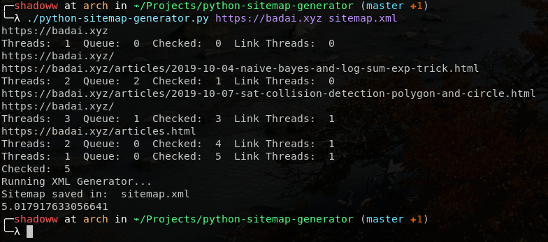

# Python Sitemap Generator
- Version: 0.6
- Date: 24/06/2021
- Authors: Przemek Wiejak @ przemek@wiejak.us, Aleksei Tcelishchev, Noa-Emil Nissinen

Python Site Map Generator uses python multi-threaded approach to read all links accessible through the Web site and generate proper sitemap for SEO purposes. 
Script was meant to use threading technology to allow easy and very fast approach while generating sitemaps for your Web pages.
The script will run under GNU/Linux operating system with Python 3 installed.

## REQUIREMENTS
- Python 3
- python-beautifulsoup

## USAGE
- Set script to executable: chmod +x python-sitemap-generator.py
- Run script: ./python-sitemap-generator.py https://example.com sitemap.xml

